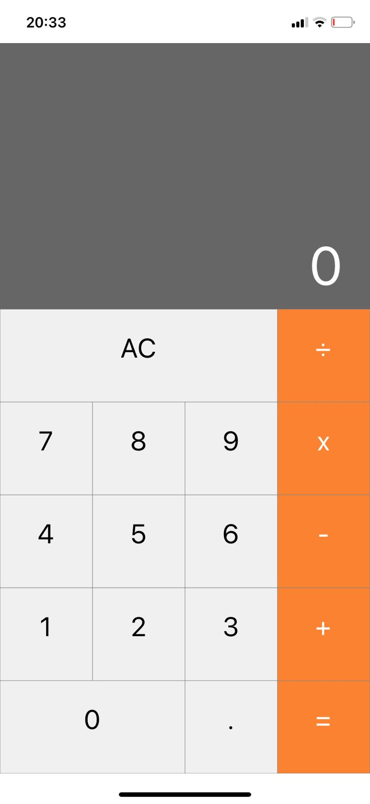

# Calculadora

<div align="center">
  
</div>

## 📱 Sobre o Projeto

Este projeto é uma calculadora desenvolvida com React Native e Expo. A aplicação oferece uma interface intuitiva e responsiva para realizar operações matemáticas básicas, semelhante às calculadoras disponíveis em dispositivos móveis.

## ✨ Funcionalidades

- Operações básicas: soma (+), subtração (-), multiplicação (×) e divisão (÷)
- Limpeza de memória (AC)
- Suporte para números decimais
- Interface responsiva
- Design moderno

## 🚀 Tecnologias Utilizadas

- [React Native](https://reactnative.dev/)
- [Expo](https://expo.dev/)
- JavaScript

## 📋 Pré-requisitos

Para executar este projeto, você precisará ter instalado em sua máquina:

- [Node.js](https://nodejs.org/)
- [npm](https://www.npmjs.com/) ou [Yarn](https://yarnpkg.com/)
- [Expo CLI](https://docs.expo.dev/get-started/installation/)

## 🔧 Instalação

1. Clone este repositório
```bash
git clone https://github.com/seu-usuario/calculadora.git
```

2. Acesse a pasta do projeto
```bash
cd calculadora
```

3. Instale as dependências
```bash
npm install
# ou
yarn install
```

4. Inicie o projeto
```bash
npm start
# ou
yarn start
```

5. Escaneie o QR Code com o aplicativo Expo Go (Android) ou a câmera (iOS)

## 📱 Executando no Emulador

Para executar no emulador Android:
```bash
npm run android
# ou
yarn android
```

Para executar no emulador iOS:
```bash
npm run ios
# ou
yarn ios
```

## 📂 Estrutura do Projeto

```
calculadora/
├── App.js              # Componente principal
├── app.json            # Configurações do Expo
├── assets/             # Imagens e recursos
├── babel.config.js     # Configurações do Babel
├── package.json        # Dependências
└── src/
    ├── components/     # Componentes reutilizáveis
    │   ├── Button.js   # Componente botão da calculadora
    │   └── Display.js  # Componente de exibição do resultado
    ├── contexts/       # Contextos React
    ├── hooks/          # Custom hooks
    ├── screens/        # Telas da aplicação
    ├── styles/         # Estilos globais
    ├── types/          # Definições de tipos
    └── utils/          # Funções utilitárias
```

## 📝 Licença

Este projeto está sob a licença MIT. Veja o arquivo [LICENSE](LICENSE) para mais detalhes.

## 👨‍💻 Desenvolvido por

Seu Nome - [GitHub](https://github.com/seu-usuario)
